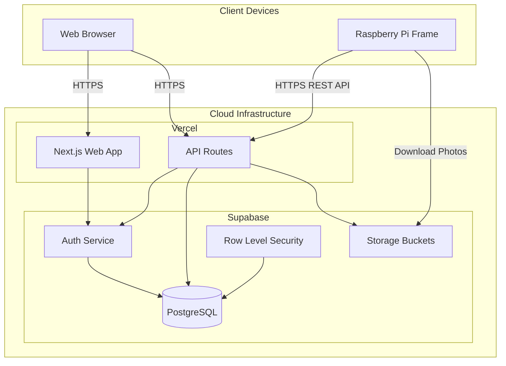
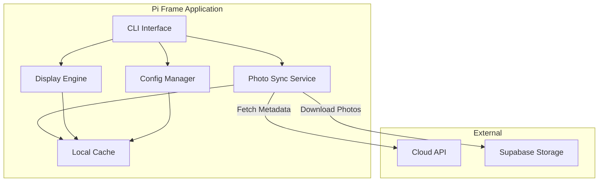
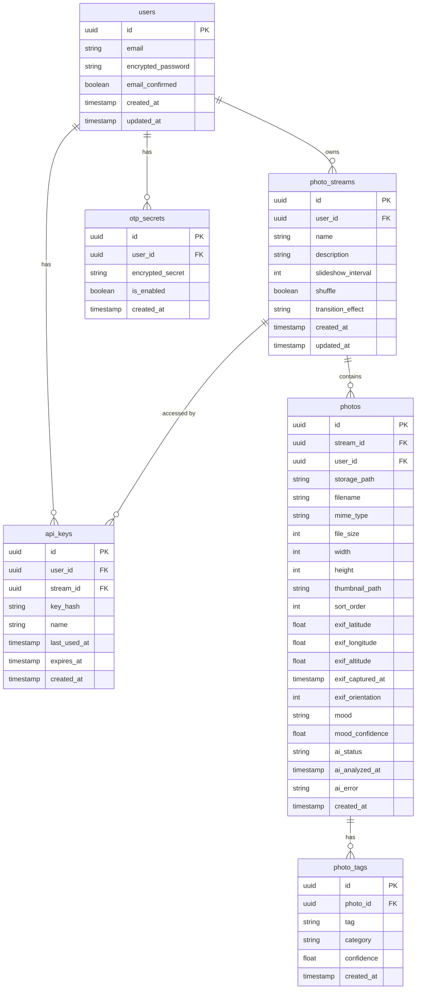
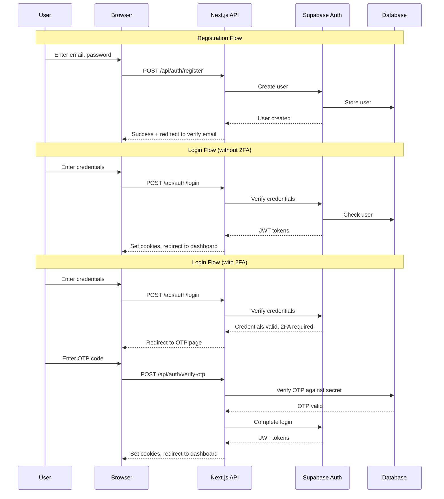
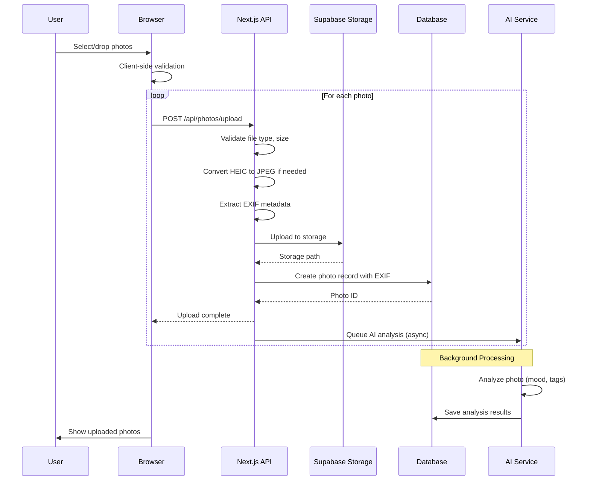
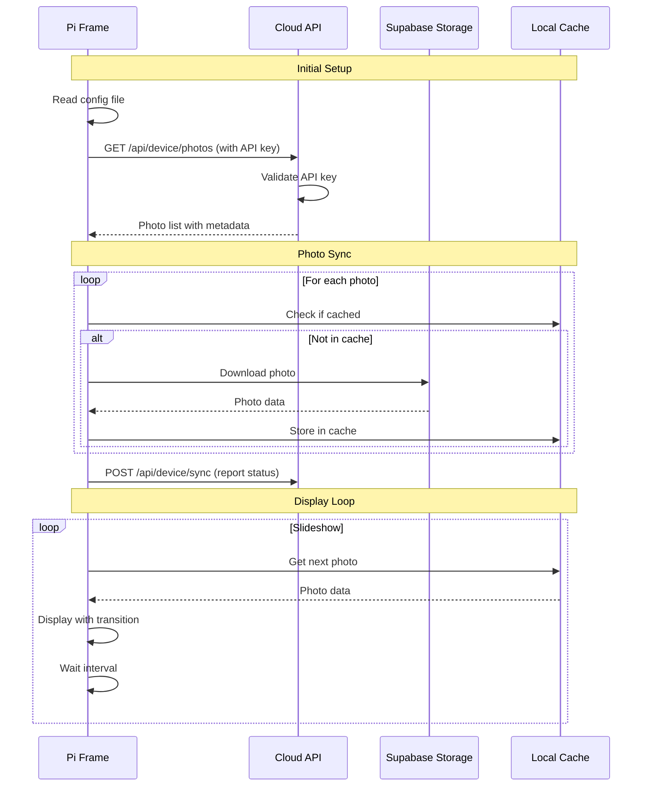
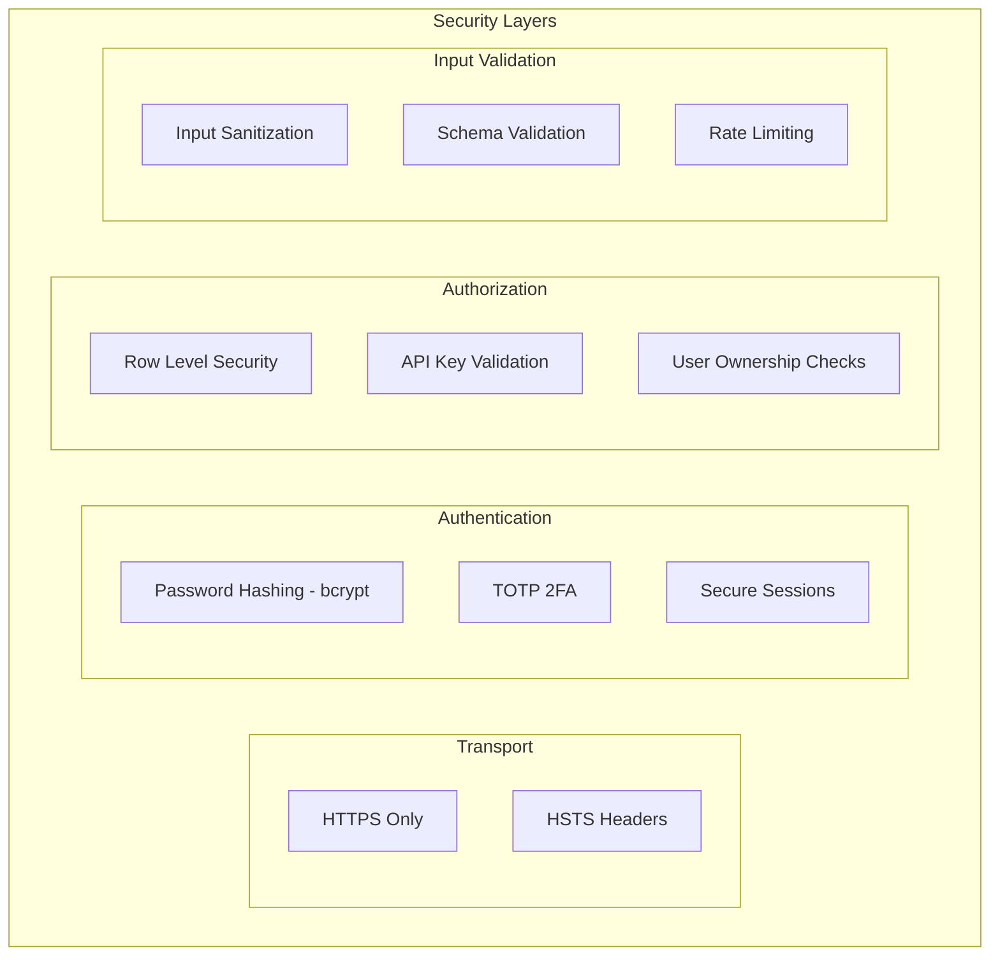
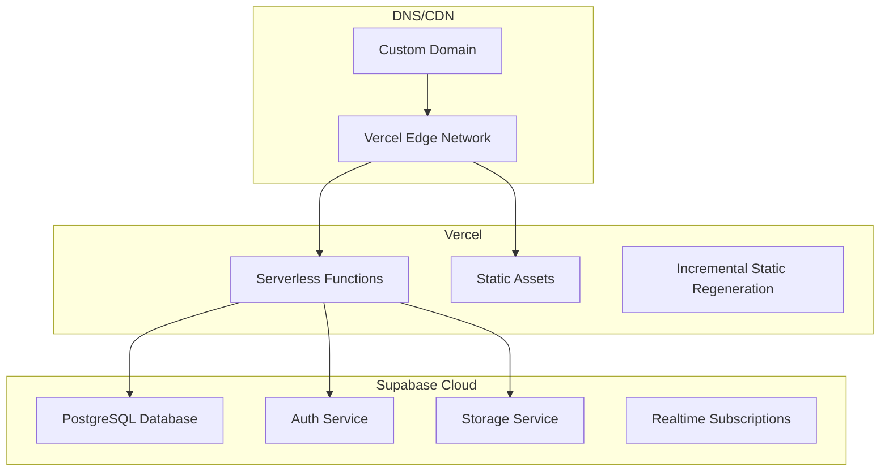

# Froggie Frame Architecture

This document describes the architecture of the Froggie Frame system, which consists of two main components: the Raspberry Pi photo frame application and the cloud-based web management interface.

## System Overview



## Component Architecture

### 1. Web Application (Next.js)

The web application follows Next.js 14 App Router conventions with a focus on security and user experience.

```mermaid
graph LR
    subgraph "Next.js App Router"
        subgraph "App Directory"
            LAYOUT[layout.tsx]
            PAGE[page.tsx]

            subgraph "Routes"
                AUTH_ROUTES[/auth/*]
                DASH[/dashboard]
                STREAMS[/streams/*]
                PHOTOS[/photos/*]
                SETTINGS[/settings]
            end

            subgraph "API Routes"
                API_AUTH[/api/auth/*]
                API_STREAMS[/api/streams/*]
                API_PHOTOS[/api/photos/*]
                API_DEVICE[/api/device/*]
            end
        end

        subgraph "Components"
            UI[UI Components]
            FORMS[Form Components]
            PROVIDERS[Context Providers]
        end

        subgraph "Lib"
            SUPABASE_CLIENT[Supabase Client]
            VALIDATORS[Input Validators]
            UTILS[Utilities]
        end
    end
```

#### Directory Structure

```
web/
├── app/
│   ├── (auth)/
│   │   ├── login/
│   │   ├── register/
│   │   ├── verify-otp/
│   │   └── forgot-password/
│   ├── (dashboard)/
│   │   ├── dashboard/
│   │   ├── streams/
│   │   │   ├── [id]/
│   │   │   └── new/
│   │   ├── photos/
│   │   └── settings/
│   ├── api/
│   │   ├── auth/
│   │   ├── streams/
│   │   ├── photos/
│   │   └── device/
│   ├── layout.tsx
│   └── page.tsx
├── components/
│   ├── ui/
│   ├── forms/
│   ├── photo/
│   ├── ai/
│   └── streams/
├── lib/
│   ├── supabase/
│   ├── validators/
│   ├── ai/
│   ├── exif/
│   └── utils/
├── hooks/
├── types/
└── middleware.ts
```

### 2. Raspberry Pi Application

The Pi Frame application is a lightweight Python application designed for minimal resource usage.



#### Directory Structure

```
pi-frame/
├── froggie_frame/
│   ├── __init__.py
│   ├── cli.py
│   ├── config.py
│   ├── sync.py
│   ├── display.py
│   └── cache.py
├── froggie-frame.py
├── requirements.txt
├── froggie-frame.service
└── install.sh
```

## Data Model



## Authentication Flow



## Photo Upload Flow



## Pi Frame Sync Flow



## Security Architecture

### Authentication Security



### Row Level Security Policies

```sql
-- Users can only see their own data
CREATE POLICY "Users can view own streams" ON photo_streams
    FOR SELECT USING (auth.uid() = user_id);

CREATE POLICY "Users can view own photos" ON photos
    FOR SELECT USING (auth.uid() = user_id);

-- API keys can access associated stream's photos
CREATE POLICY "API keys can view stream photos" ON photos
    FOR SELECT USING (
        EXISTS (
            SELECT 1 FROM api_keys
            WHERE api_keys.stream_id = photos.stream_id
            AND api_keys.key_hash = current_setting('app.api_key_hash')
        )
    );
```

### Security Headers

The application implements comprehensive security headers:

```typescript
const securityHeaders = {
  'Content-Security-Policy': `
    default-src 'self';
    script-src 'self' 'unsafe-eval' 'unsafe-inline';
    style-src 'self' 'unsafe-inline';
    img-src 'self' blob: data: https://*.supabase.co;
    connect-src 'self' https://*.supabase.co;
    frame-ancestors 'none';
  `,
  'X-Frame-Options': 'DENY',
  'X-Content-Type-Options': 'nosniff',
  'Referrer-Policy': 'strict-origin-when-cross-origin',
  'Permissions-Policy': 'camera=(), microphone=(), geolocation=()',
  'Strict-Transport-Security': 'max-age=31536000; includeSubDomains'
};
```

## Deployment Architecture



## Raspberry Pi Hardware Requirements

| Component | Minimum | Recommended |
|-----------|---------|-------------|
| Model | Raspberry Pi 3B | Raspberry Pi 4 (2GB+) |
| Storage | 8GB SD Card | 32GB+ SD Card |
| Display | HDMI-compatible | Official 7" Touchscreen |
| Network | WiFi or Ethernet | WiFi 5GHz |

## Performance Considerations

### Web App
- Server-side rendering for initial page loads
- Client-side caching with SWR
- Image optimization via Next.js Image component
- Lazy loading for photo galleries

### Pi Frame
- Local photo caching to minimize network requests
- Preloading next photos during slideshow
- Memory-efficient image handling
- Graceful handling of network interruptions

## Future Enhancements

1. **Real-time Updates**: WebSocket connection for instant photo updates
2. **Multiple Streams per Frame**: Allow frames to cycle through multiple streams
3. **Scheduling**: Time-based stream switching
4. **Analytics**: View statistics and frame status monitoring
5. **Mobile App**: Native iOS/Android companion app
6. **Smart Cropping**: Face detection for portrait photo cropping
7. **Photo Albums**: Auto-organize photos by location, date, or AI-detected content
